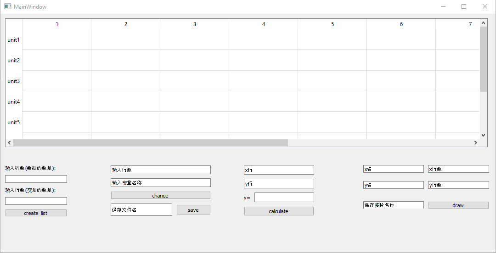
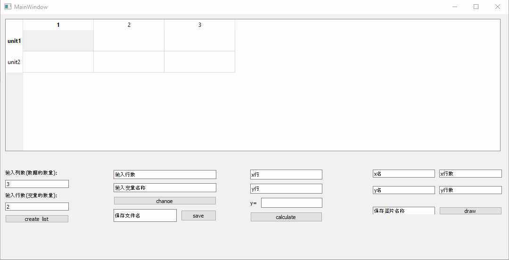
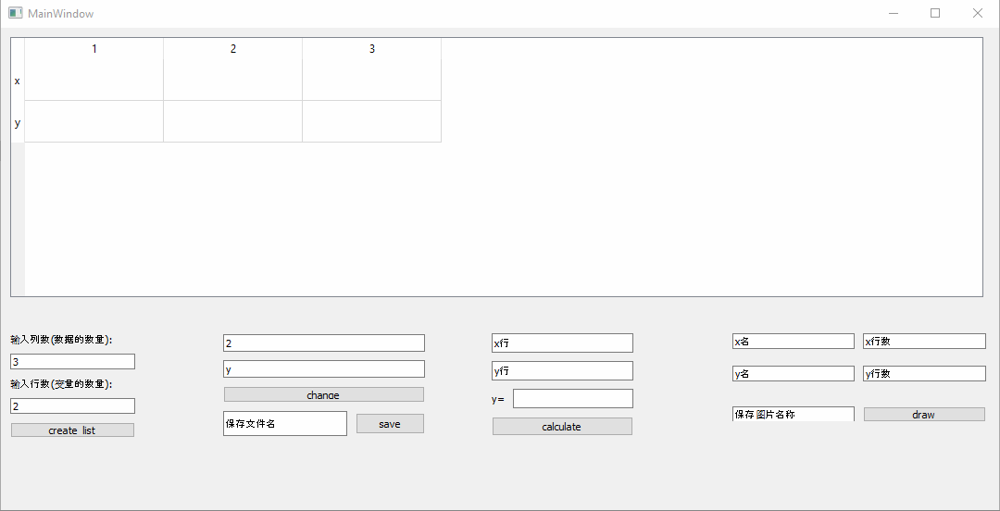
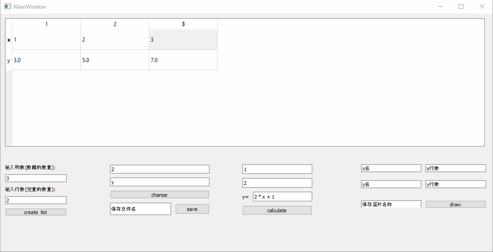
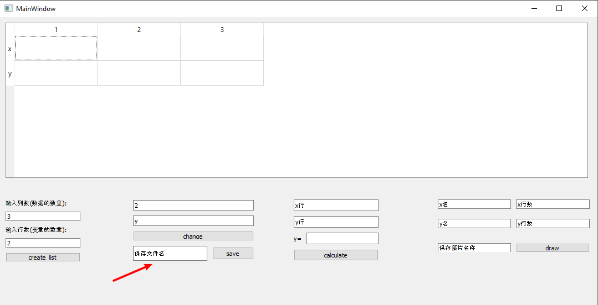

# Orange🍊 -- 线性数据分析软件

[](https://github.com/Ninglo/Orange/blob/master/LICENSE)
[](http://ninglo.xyz)

date of coding: 19/11/6 - 19/11/8

---


## 环境要求

* Python3
* pip
* pandas
* PyQt5
* numpy
* malplotlib
* xlsxwriter

## 使用说明

### 在安装完成依赖项以后

**打开软件**

命令行操作:
```bash
$ python3 main.pyw
```
图形界面:
```
双击 main.pyw
```

### 操作示范视频(链接)


## 功能介绍

0. 单元格设置

    
    

1. 数据计算

    

2. 线性拟合

    

3. 数据保存

    
